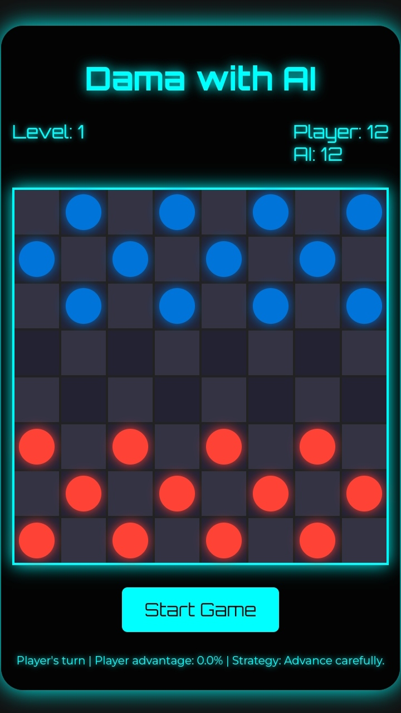

# Dama with AI

## Description
"Dama with AI" is a modern take on the classic board game Dama, integrated with AI to provide challenging gameplay against the computer. This project utilizes HTML, CSS, and JavaScript to create an interactive and engaging experience.

## Features
- Play against an AI opponent.
- Track your score and level.
- Modern and responsive design.
- Easy-to-use controls.

## Screenshot


## Installation
1. Clone the repository:
    ```bash
    git clone https://github.com/JohnDev19/dama-with-ai.git
    ```
2. Navigate to the project directory:
    ```bash
    cd dama-with-ai
    ```
3. Open `index.html` in your preferred web browser.

## Usage
1. Open the game in your web browser.
2. Click the "Start Game" button to begin.
3. The AI opponent will make moves automatically.
4. Track your score and level in the info panel.

## Contributing
1. Fork the repository.
2. Create a new branch (`git checkout -b feature-branch`).
3. Make your changes and commit them (`git commit -am 'Add new feature'`).
4. Push to the branch (`git push origin feature-branch`).
5. Create a new Pull Request.

## License
This project is licensed under the MIT License.
